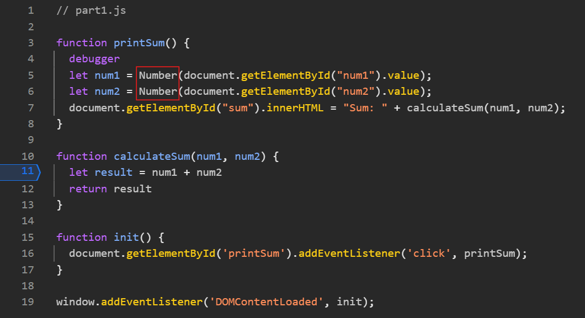

1. The bug was that the numbers inputted were being cast as strings, so where they were supposed to be added in the result expression, they were concatenated instead. For instance, 10 + 20 would be interpreted as "10" + "20" = "1020". 
2. I would fix this by explicitly casting num1 and num2 to be numbers. When I did so using Chrome DevTools, the result of inputting 10 and 20 was 30, as expected. My fix can be seen here, with the edited elements boxed in red: .